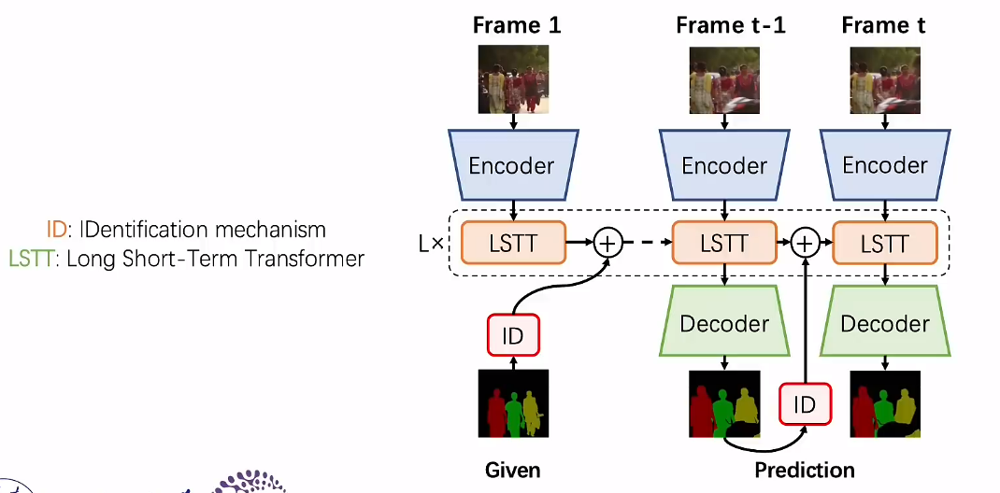

# AOT
> Associating Objects with Transformers for Video Object Segmentation  

## Background
视频目标分割VOS  
Semi-supervised Video Object Segmentation  
给定视频开始若干帧的若干标注，让其传播到整个视频

## Revisit VOS solutions
以往的VOS倾向于对单个目标设计网络结构，对多目标场景就独立地匹配分割各个目标  
最终合并各个单目标的预测结果来生成多目标预测结果  
会导致网络过多的聚焦于前景目标上，忽略了相对背景的上下文关  
> Existing Challenge: Background Confusion  

为了让前面物品的特征表现更好，会将背景混淆进来  
且整体的计算量会随着目标数线性增加  

## Associating Objects with Transformers
利用全目标的上下文关系，提高多目标的处理效率  
> Embed, match, propagate, and decode all the objects uniformly  

### Identification Mechanism
Identification Embedding  

Identification Decoding  

### Long Short-Term Transformer
Long term Attention  

Short term Attention  

# DeAOT
> Decoupling Features in Hierarchical Propagation for Video Object Segmentation

## Abstract
一种更有效的半监督视频对象分割层次传播方法  

在ViT的基础上，结合objects（AOT），引入hierarchical propagation  
分层传播可以逐渐将信息从过去帧传到当前帧  
而对象特定信息增加会导致与未知对象的视觉信息的损失，于是本文提出分层传播方法中的解耦特征  
DeAOT将特定对象与不可知对象在两个独立分支中处理以达到解耦。其次，为了弥补双分支传播的额外计算，提出了一种有效模块来构建分层传播  

## Introduction
在给定一个或多个帧的注释掩码的情况下，追踪和分割视频中的对象  

随着注意力机制的进步，基于注意力的VOS方法取得了显著进步  
利用记忆网络存储和读取过去帧的目标特征，应用注意力机制匹配当前帧的目标  
AOT引入Transformer，分层关联多个对象  

为了避免在更深的传播层中丢失视觉信息，并促进视觉嵌入的学习，在传播中解耦未知对象和特定对象  
于是，本文提出一种新的VOS分层传播方法  
> Unlike AOT, which shares the embedding space for visual (**object-agnostic**) and ID (**object-specific**) embeddings, DeAOT decouples them into different branches using individual propagation processes while sharing their attention maps.  

> To compensate for the additional computation from the dual-branch propagation, we propose a **more efficient module** for constructing hierarchical propagation, i.e., Gated Propagation Module (GPM).

