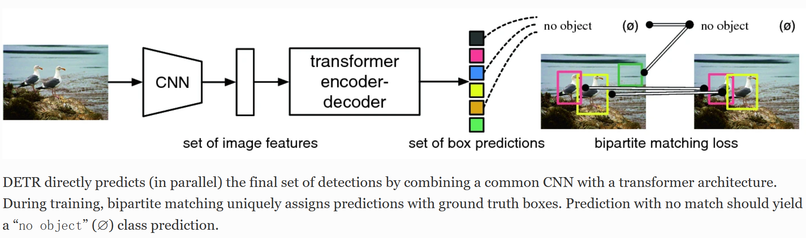
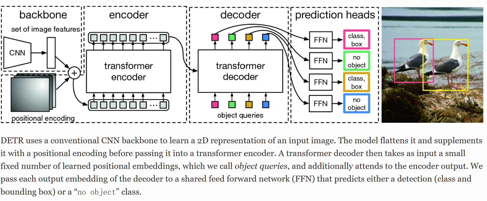
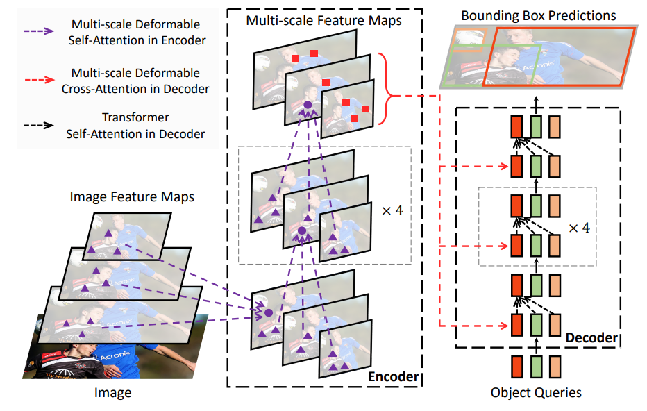

# Detection Transformer
> End-to-End Object Detection with Transformers

## Abstract
将DETR看作集合预测问题，没框：坐标，类别。简化了网络  
> DETR are a set-based global loss that forces unique predictions via biapatite matching (二分图匹配), and a transformer encdoer-decoder architecture

the global image context to directly output the final set of predictions in parallel  
simple and does not require a specialized library  
DETR can be easily generalized to produce panoptic segmentation

## Introduction
> Modern detectors address this set predition task in an indirect way, by defining surrogate regression and classification problems on a large set of proposals

会生成大量重复冗余的框，难优化难调参  
目标做一个端到端的网络，而不需要过多先验知识，同时能在困难数据集取得好成绩  

1. 卷积神经网络抽特征
2. TransformerEncoder学全局特征
3. TransformerDecoder生成预测框
4. 将预测框与ground truth的框做匹配，在匹配上的框里算matching loss

DETR对大物体表现好(归功于transformer全局建模)，但小物体较差，还需后续进化。另外DETR训练起来很慢。  

## Related Work
> Most modern object detection methods make predictions relative to some initial guesses

DETR想让目标检测尽量简单，无需用到过多的先验知识

### The DETR Model
1. 基于集合的目标函数
2. DETR结构

#### 1. Object Detection Set Prediction Loss
DETR infers a fixed-size set of N prediction, where N is set to be significantly larger than the typical number of objects in an image  
二分图匹配，cost matrix，匈牙利算法，scipy.linear_sum_assignment  
- 遍历所有的输出框去和ground truth的框算loss
- loss放进cost matrix，用匈牙利算法得出最佳匹配  
- 知道匹配框后，算真正的目标函数，用此loss去做梯度回传

#### 2. DETR Architecture

### Experiments
encoder抽语义特征，decoder恢复特征，加入细节

### Conclusion
DETR框架，在COCO数据集上与Faster R-CNN打成平手，在全景分割上取得了更好的结果  
DETR因为用来self-attention而有全局信息，所以在大物体识别上效果很好  
训练时间和小目标检测等问题还需后续优化

# Deformable DETR
> Deformable Transformers for End-to-End Object Detection

> 可变形卷积：给每个卷积核参数添加一个方向向量，使得卷积核可以变为任意形状

## 研究背景
DETR成功实现了目标检测，但DETR需要更多的epoch才能收敛，而且很难检测出小物体  

## 研究方法
让Attention只关注图片的部分像素，具体关注哪些由模型学习得出  
通过这种方式能够更快收敛，而时间复杂度的降低，能够很容易地使用多尺寸的feature map预测

## 核心思想
### 可变形注意力
self-attention：每个query和所有的key去做内积计算权重  
deformable-attention：query不再和全局每个位置的key计算注意力权重，而是对**每个query，仅在全局位置中采样局部位置的key（自学习），并且value也是局部位置的value，最后把局部的注意力权重和局部value进行计算**

### 多尺度可变形多头注意力
将可变形注意力应用到多尺度特征上

