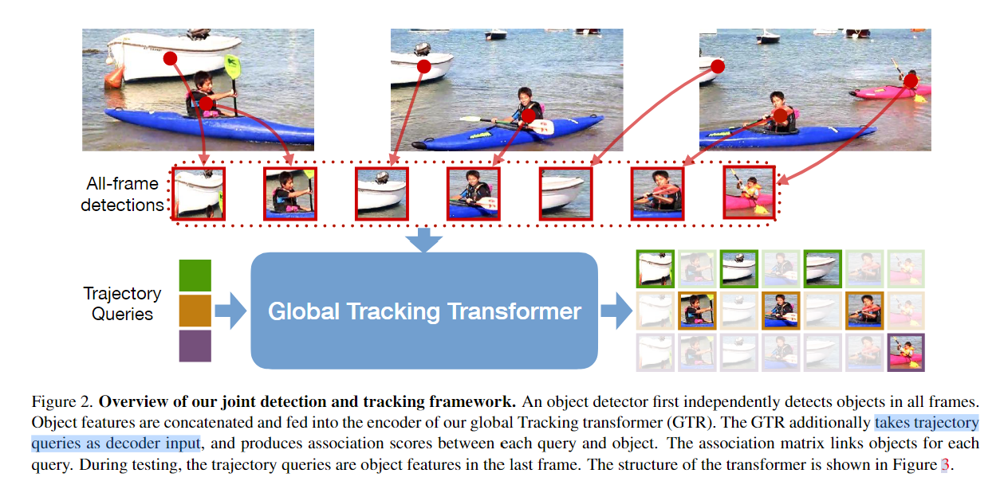

# Global Tracking Transformers

## Abstract
本文提出了一种新的基于Transformer的全局MOT架构  
以一个短时间的帧序列作为输入，为所有对象产生**全局轨迹**  
核心组件是global tracking transformer，对序列中**所有帧的对象**进行操作：对所有帧中的对象特征进行编码，并使用trajectory query将他们分组（trajectory query来自单个帧的对象特征）  
GTR不需要中间成对分组和组合关联，并且可以和object detector联合训练

## Introduction
介绍Tracking by detection、Tracking by regression和Global trackers  
GTR对来自多个连续帧的检测进行编码，并使用trajectory query将它们分组为trajectories，trajectory queries是在非最大抑制后的单个帧的检测特征并被GTR转换为轨迹  
每个trajectory query使用softmax分布为每个帧分配一个detection，生成一个全局trajectory  
推理时，以32帧的中等时间滑动窗的方式运行GTR，并在在线链接窗口间的轨迹  
模型在时间窗口内是端到端可微的

## Related Work
> **Local multi-object tracking**: In contrast, we do not rely on pairwise association, but instead associates to all objects across the full temporal window via a transformer.  
> **Global tracking**: Our method directly outputs consistent long-term trajectories without combinatorial optimization. This is done by a single forward pass in a relatively shallow network.  
> **Transformers in tracking**: Our transformer uses queries to generate entire trajectories at once. Our queries do not generate new boxes, but group already-detected boxes into trajectories.  
> **Video object detection**: We explicitly learn object association in a supervised way for tracking.

## Preliminaries
定义object detection，tracking，tracking by detection 

> In this work, we show how to perform joint detection and global association within a single forward pass through a network. **The network learns global tracking within a video clip of 32 frames in an end-to-end fashion**.

## Global tracking transformers

### Tracking Transformers
- 输入32帧图片，对图片进行检测，预测图片中的物体{Pi}，预测物体的box{bi}，同时取出box的特征{fi}  
- 将所有帧的{fi}作为query输入transformer  
- 每个query和object生成score 向量即流程图transformer的输出  
  > transformer的输入是两个roi feature，不同的是左边的query会不断的更新内容  
  第一个query是第一帧中的船头，这个query会和上面输入的roi feature做关联，和所有帧中的所有feature生成IOU的score，和帧中的船头会有较高score，其他的则是较低的score
- 通过这个score 向量，设置0.5的阈值，我们就可以获得其他帧中物体属于的query
- 在每一帧中单独对同一个轨迹的匹配分数做一次Softmax，通过找最大的概率，可以直接获得一条轨迹，在训练过程中，作者通过最大化PA来让网络学会这种能力

### Training
整太复杂了，全是符号和公式，吃力了
### Online Inference
