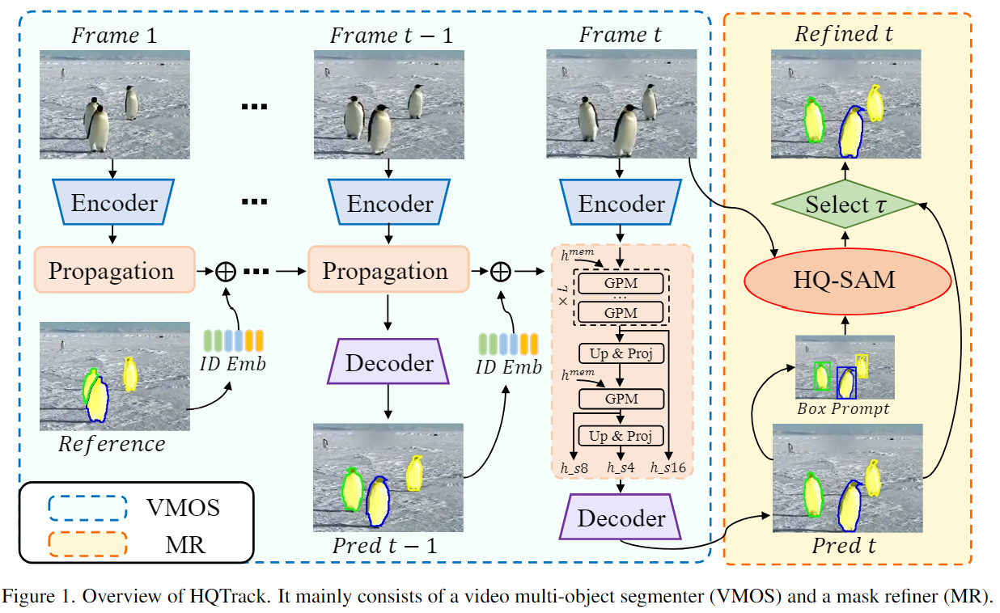

# Segment Anything in High Quality

## Abstract
尽管使用110亿个掩码进行训练，但SAM的掩码预测质量在有些情况依然很差，尤其是面对复杂结构时。  
> We propose HQ-SAM, equipping SAM with the ability to accurately segment any object, while maintaining SAM's original promptable design, efficiency, and zero-shot generalizability.  

设计了一个可学习的高质量output token，将其注入到SAM的掩码解码器中，预测高质量掩码。另外还将其与ViT特征融合，改进掩码细节  
在一个44k的数据集上训练这些参数，在八块GPU上只需四小时  

## Introduction
SAM作为一个通用图像分割的基础视觉模型，凭借其强大的zero-shot能力，引起了范式的转变  
但SAM也有不足，掩码会忽略薄物体，在复杂结构时会有较大误差。而在一些图像/视频编辑任务中，高精度掩码是至关重要的  
提出HQ-SAM，可以提供高精度的分割掩码。而且为了保持SAM的efficiency和zero-shot performance，只是做了很小的调整，添加了不到0.5%的参数  

直接微调SAM的解码器或引入新的解码器模块会降低zero-shot性能  
作者设计了一个可学习的HQ-Output Token，同原始prompt和Output Token一起输入到SAM的掩码解码器中。HQ-Output Token并不是重用mask decoder的特征，而是运行在一个细化的特征集上，将SAM的decoder features与ViT encoder的features融合来构造  
训练期间，冻结SAM预训练的参数，只更新HQ-Output Token相关参数  

SAM采用超大数据集训练，但成本巨大且达不到高质量掩码。作者构造了一个44k大小的及其细粒度掩码注释的数据集。HQ-SAM在8块3090上仅需训练4个小时  
作者做了广泛的实验，HQ-SAM可以产生更高质量掩码，同时保持zero-shot能力

# Tracking Anything in High Quality

## Abstract
感知算法的提升使得单/多目标追踪和基于框/基于掩码追踪可以统一  
HQTrack由一个video multi-object segmenter和一个mask refiner组成，在不使用其他技巧的情况下，在VOTS2023中取得第一  

## Introduction
先概述visual object tracking和video object segmentation，包括介绍AOT，DeAOT。目前VOS方法很好，但在VOTS23中也有困难：视频序列长、目标消失与返回、高速运动、遮挡干扰等  

本文提出HQTrack，主要由VMOS和MR组成  
VMOS是DeAOT的变体，增加了一个GPM门控传播模块，用于感知小物体。另外还使用了Intern-T作为特征提取器，增强对象识别能力  
使用大模型来细化tracking mask，但SAM在预测复杂结构对象时容易出错，使用HQ-SAM来提升追踪掩码  

## Method
### Pipeline

给定视频和第一帧注释（参考帧？），VOMS分割每一帧的目标对象，当前帧的结果依赖于前面帧沿时间维度的传播，VOMS建模了对象的外观/ID，还拥有long/short term memory  
接着，使用HQ-SAM来提升掩码。对VOMS预测的目标掩码做边界框提取，作为HQ-SAM的prompt同原始图片一起输入  
最后，通过一个mask selector从VOMS和MR间选择结果  

### VMOS
#### DeAOT
AOT将多个对象关联到一个嵌入空间，能在单个传播中处理多个对象。DeAOT是一个视频对象分割模型，具有类似AOT的分层传播，而为了缓解未知对象信息损失，提出GPM模块，将外观和身份嵌入的传播进行解耦  

#### VMOS
为了提高分割性能，特别是感知微小物体，在DeAOT基础上级联了8x scale的GPM  
> In our VMOS, considering the memory usage and model efficiency, we only use upsampling and linear projection to upscale the propagation features to 4× scale. Multi-scale propagation features will be fed into the decoder along with multi-scale encoder features for mask prediction.

Intern-T被用做encoder以加强目标识别能力

### MR
#### SAM and HQ-SAM
SAM通过大量高质量注释数据集训练，具有很强的零样本能力以及灵活的交互机制，然而，在处理复杂结构对象时，预测掩码仍有不足  
HQ-SAM在SAM模型基础上额外引入参数，将学习到的output token注入到SAM的mask decoder中，得到高质量掩码  

#### MR
VOMS模型在尺度有限的闭集数据集训练，给出的掩码困难质量不高。因此使用分割算法来提炼分割结果会有很大性能提升  
将VOMS计算的预测掩码的外部框作为prompt，同原始图片一起输入HQ-SAM中，得到提炼后的掩码，最后从二者的掩码结果中进行选择  
为了让HQ-SAM专注于提炼当前对象掩码，而不是重新预测一个新的对象，设置IoU阈值，只有高于阈值才会选择HQ-SAM的结果  

