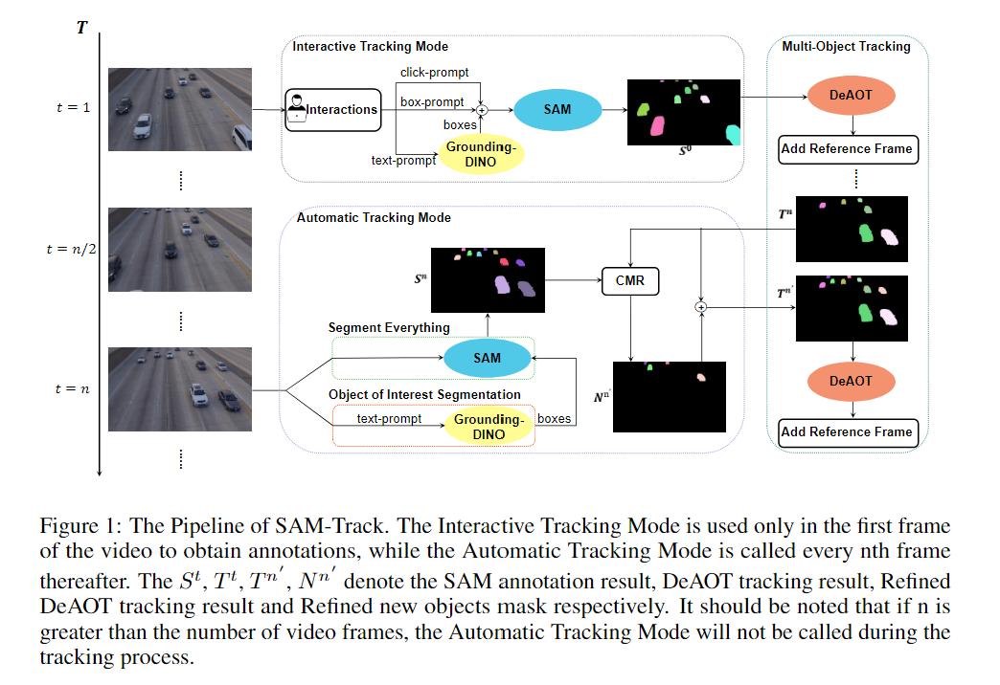
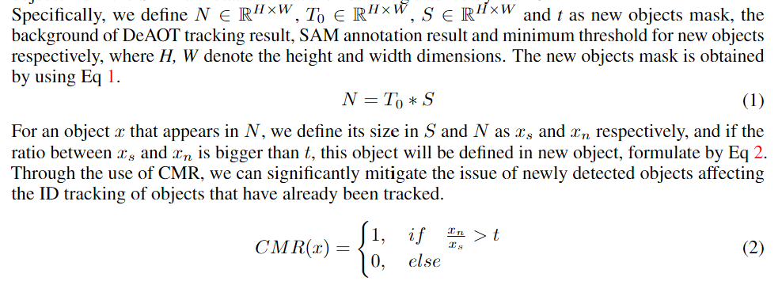

# Segment and Track Anything

## Abstract
Segment and Track Anything可以让用户精确有效地分割和跟踪视频中任何对象  
SAM-Track支持多模态的交互方式，使用户能够对视频中多个对象进行追踪  
SAM-Track使用了基于AOT的追踪模型DeAOT，是一种交互式关键帧分割模型  

## Introduction
对于视频分割，不同领域需求不同，进而分割模型需要支持多种交互模式。然而，还没有一个统一的框架进行视频分割以满足每个领域的不同需求  

SAM能够根据各种prompts生成高质量对象掩码，另外还有很强的zero-shot表现  
但直接将SAM应用于视频分割效果并不好，因为没有考虑帧之间的时间一致性；另外SAM不输出语义标签  
因此，SAM并不适用于强调跨帧对象之间关系的任务  
考虑到SAM的优缺点，本文在视频分割领域对SAM做了调整  

SAM-Track使用SAM交互地获得关键帧片段，做为DeAOT的reference  
然后DeAOT传播reference frames以追踪视频后续帧中的多个对象  
为了提高SAM-Track的语言理解能力，作者将Grounding-DINO集成到系统中  
有了Grouding-DINO强大的开放集目标检测能力，SAM-Track可以交互地选择对象进行跟踪与分割  

SAM-Track具有显著的跟踪和分割能力以及两种user-friendly的交互模式  
interactive mode可以多模态的输入以追踪任何对象，用户交互只允许选择视频第一帧  
automatic mode下SAM-Track跟踪出现在视频任何帧的任何新对象  

## Preliminaries
### DeAOT
DeAOT是一个基于AOT的VOS模型，采用识别机制将同一高维空间中的多个目标关联起来，使其能够以追踪单个对象的速度追踪多个对象  
DeAOT采用特别的模块将特定对象与未知对象从过去帧分别传播到当前帧，保留了未知对象的视觉信息

### SAM
SAM通过专门设计的训练方法和大规模数据集，使得其不仅支持交互式分割，而且在广泛的分割任务中表现出出色的zero-shot性能  
SAM这两个特征让其有着广泛适用性，在CV领域很有前景

### Grounding-DINO
Grounding-DINO是一个开放集对象检测器  
> Given text categories or a detailed reference of the target object, Grounding-DINO can detect the target objects and return the minimum external rectangle for each target.

## Methodology

### Interactive tracking mode
> This subsection will introduce the pipeline for the interactive tracking mode of SAM-Track, as well as the details of how it integrates with Grounding-DINO, SAM, and DeAOT for object detection, annotation, and tracking.

> DeAOT achieves promising results on various benchmarks. 
然而，作为半监督视频分割模型，DeAOT需要reference frame注释进行初始化  

利用SAM的高度交互分割方法，可以获得任何视频准确且高效的注释  
具体来说，在参考帧中使用SAM的分割对象方法，然后DeAOT将分割结果作为注释，使用GPM模块将视觉嵌入和ID嵌入从过去帧分层传播到当前帧，以逐帧追踪对象  

SAM也有一定局限性，它并没有提供足够的语义信息，而textual prompt可能也无法有效支持对对象分割进行更细微的理解的任务  
于是将Grounding-DINO集成到SAM-Track中做为监听器，利用其强大开放集对象检测能力，使得在参考帧中可以使用自然语言交互地选择对象  
Grounding-DINO将文本类别或不同对象的详细描述做为输入，并为每个目标产生最小的外部矩形；SAM随后利用这些矩形作为提示框来预测每个对象的掩码；DeAOT然后使用生成的对象掩码来跟踪视频中的对象

### Automatic tracking mode
> This subsection will introduce the automatic tracking mode of SAM-Track, including how it tracks new objects appearing in video and the definition of new objects.

前一个模式因为缺乏注释而无法处理视频中新出现的对象，提出两种方法来获取每帧新对象的注释：**Segment Everything** & **Object of Interest Segmentation**  

**Segment Everything** 使用SAM的segment-everything函数来获得关键参考帧中每个对象的对象掩码；然后DeAOT基于合并的注释来跟踪新出现对象和原来的对象  
**Object of Interest Segmentation** 利用Grounding-DINO和SAM来获取视频中新对象的注释，Grounding-DINO将根据预定义的文本提示检测每帧的对象，接着如前所述，SAM和DeAOT对新对象注释和跟踪  

定义新对象是困难的，每个对象都有唯一的ID，DeAOT用ID来区分对象  
如果直接为关键帧中注释的所有对象分配新的ID，那将导致ID Switch  
使用Comparing Mask Results来确定新对象，在CMR中，比较DeAOT的跟踪结果和SAM在关键帧的注释结果，从DeAOT未跟踪的注释对象中选择  

> Through the use of CMR, we can significantly mitigate the issue of newly detected objects affecting the ID tracking of objects that have already been tracked.

### Fusion tracking mode
SAM-Track中的每个交互方法都可以和自动追踪模式相结合  
Interactive Tracking mode未视频第一帧获取注释，而Automatic Tracking mode追踪视频中出现的新对象  

