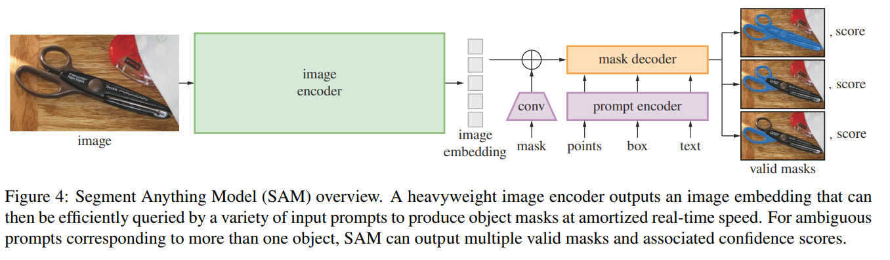
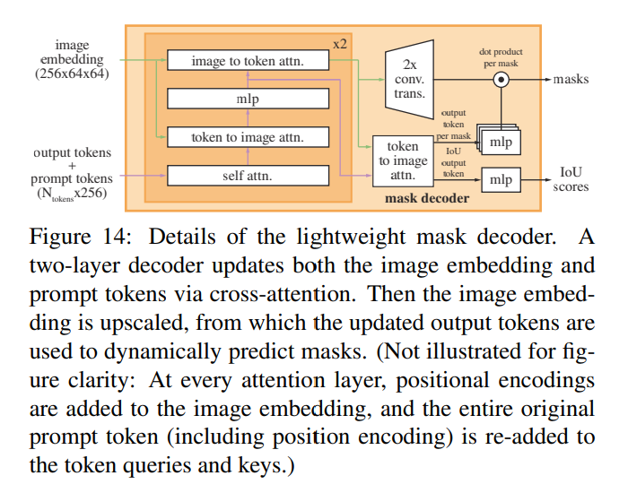

# SAM
> Segment Anything

任务：输入各种分割提示（选点、矩形框、区域、文本提示）+图片，模型进行处理输出mask  
使用prompt encoder和image encoder处理输入，而后放进lightweight mask decoder处理输出  

## Abstract
建立了迄今为止最大的数据集并进行了超1 billion的mask

## Introduction
> The success of this plan hinges on three components: task, model, and data. To develop them, we address the following questions about image segmentation:
> 1. What **task** will enable zero-shot generalization?
> 2. What is the corresponding **model** architecture?
> 3. What **data** can power this task and model?

## Segment Anything Task
将NLP中的prompt迁移到分割中，输出一个valid mask  

#### Pre-training
在海量数据中预训练，建立prompt，image，mask的映射联系  
#### Zero-shot transfer
在预训练阶段已覆盖很多数据以及新的情况  
#### Related tasks
各种任务都可以用本模型  
#### Discussion
> Prompting and composition are powerful tools that enable a single model to be used in extensible ways, potentially to accomplish tasks unknown at the time of model design

## Segement Anything Model
#### Image encoder
使用一个MAE pre-trained Vision Transformer，并做微调以适应高分辨率输入
#### Prompt encoder
> We consider two sets of prompts: sparse(points, boxes, text) and dense (masks)
#### Mask decoder
将图像嵌入，提示嵌入，output token映射到一个mask  

- 对token进行自注意力  
- 到图像嵌入的交叉注意力  
- 逐点MLP，更新每个token  
- 从图像嵌入到token的交叉注意力，更新图像嵌入提示信息  
- 使用转置卷积层将图像嵌入上采样4倍（输入图像缩小4倍）  
- 同时token再次图像嵌入，将更新的输出token传递给三层MLP
- MLP输出与上采样图像通道相匹配的向量  
- 两个输出空间点积得到mask  
- 用一个MLP得到置信度

#### Resolving ambiguity
模糊情况模型给出多masks
#### Efficiency
> the prompt encoder and mask decoder run in a web browser, on CPU, in ∼50ms.
#### Losses and training
> We supervise mask prediction with the linear combination of focal loss and dice loss used in

## Segment Anything Data Engine
专门构建了个数据引擎来收集mask数据集  
> The data engine has three stages:  
> 1. a model-assisted manual annotation stage  
> 2. a semi-automatic stage with a mix of automatically predicted masks and model-assisted annotation   
> 3. a fully automatic stage in which our model generates masks without annotator input 

## Segment Anything Dataset