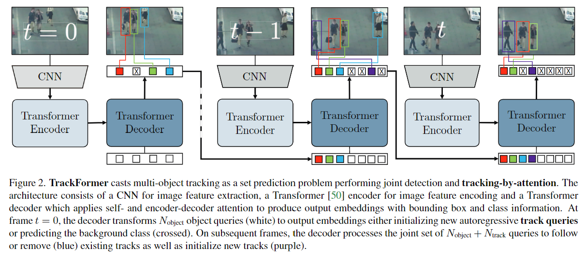
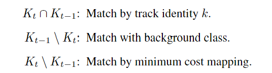

# 使用Transformer进行多目标跟踪
> TrackFormer: Multi-Object Tracking with Transformers

## Introduction & Related Work & Conclusion
**Tracking by detection**   
> 为每个帧应用目标检测算法，得到bounding box  
> 将每个框视为一个单独的节点，找到不同帧之间节点的关联并跟踪身份

**Tracking by regression**  
> 在帧T设定bounding box，在下一帧找到这些标识  
> 将边界框投影到下一帧，然后使用回归头来移动这些边界框以找到这些实体  

**Tracking by segmentation**
> 可用通过像素级的信息缓解拥挤和模糊背景的问题  
> 然后带注释的MOT分割数据稀缺，使得方法依赖于bounding box

***Tracking by attention!***  
> TrackFormer extends the recently proposed set prediction objective for object detection to multi-object tracking  

修改自DETR，使用解码器的object queries输入来进行数据关联  
使用自回归的方式在视频序列上进行跟踪对象；新进入的对象由静态query检测，然后传递给下一帧的输入  
通过attention在单个步骤中同时检测而后关联跟踪  

> We jointly tackle track initialization, identity and trajectory forming with a Transformer encoder-decoder architecture and not relying on additional matching, graph optimization or motion/appearance modeling.

TrackFormer在MOT17和MOTS20上获得了最好的结果

## TrackFormer

### 1. MOT as a set prediction problem
和DETR一样
1. CNN进行特征抽取
2. Encoder使用self-attention进行全局特征抽取
3. Decoder生成查询
4. MLP将查询映射到框和类别预测

### 2. Tracking-by-attention with queries
object queries包含两种类型  
- static object queries：在下一帧接收初始化追踪轨道
- autoregressive track queries：跨帧跟踪对象

在解码处同时执行检测和跟踪，在MLP的对象嵌入回归前，通过Transformer的解码器就进行了跟踪关联  

#### Track initialization
使用固定数量的输出嵌入检测，输出嵌入由静态和学习过的对象编码组成  
自注意力机制通过对象编码来避免重复检测  
每帧最大对象数要少于object queries的数目  

#### Track queries
携带着对象的身份信息，通过视频序列跟踪对象，以自回归方式适应位置  
新的object detection都会使用前一帧的输出嵌入来初始化track query  
> continuously updating the instance-specific representation of an object's identity and location in each track query embedding

解码器使用上一帧的输出嵌入对象编码，新出现的对象高于阈值则添加对象，否则视为背景，同时跟踪现有的对象  
得出新的对象编码后传递到下一帧  

#### Track query re-identification
因为可用对任意数量的Track queries进行解码，TrackFormer可用实现短期内的重新识别  
之前帧低于阈值而被删除的对象，依然对其进行跟踪查询，在它再次出现前，认为该query是不活动的，知道它的检测再次高于阈值  

> We keep decoding previously removed track queries for a maximum number of Ttrack-reid frames. During this patience window, track queries are considered to be inactive and do not contribute to the trajectory until a classification score higher than σ(track-reid) triggers a re-identificationre-identification.

### 3. TrackFormer training
#### Bipartite matching
将ground truth映射到预测对象  
在对象检测中，我们并不关心顺序，只需要有边界框覆盖特定对象即可  
**但在跟踪时，每个对象都有唯一的ID**，需要映射使得在所有时间范围内都不会搞混它们  
1. Track identity
2. Minimum cost mapping

三种场景：
- 前后帧都出现，encoder输入输出token进行追踪
- 下一帧不见的对象，将其与背景匹配
- 新对象，在之前帧未出现，最小成本映射

定义cost mapping，主要由分类成本和边界框回归成本组成  

#### Set prediction loss

#### Track augmentation
使用数据增强技术来提高性能  
> Enrich the set of potential track queries during the training  

1. 帧t-1是从帧t周围内随机采样的，以此模拟相机运动和低帧速率
2. 对假阴性进行采样（故意不传已经检测的对象），使模型具有更好的能力检测新对象
3. 添加误报（故意将背景作为对象传输），鼓励解码器抵御误报错误

## Result
MOTA  
MOTS20