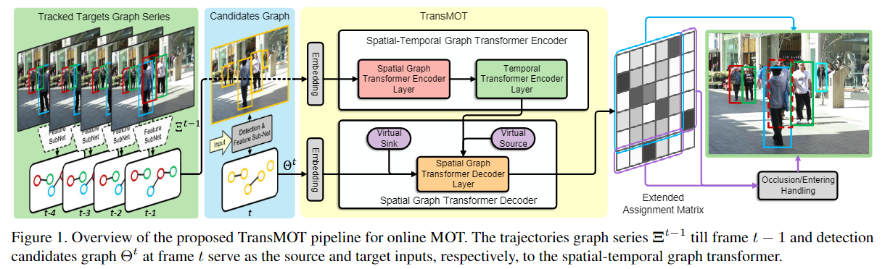
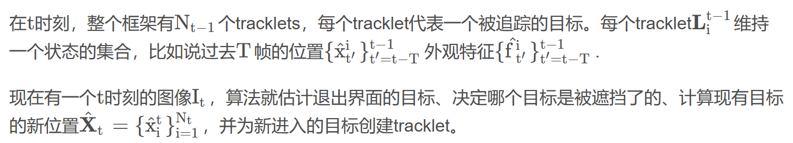
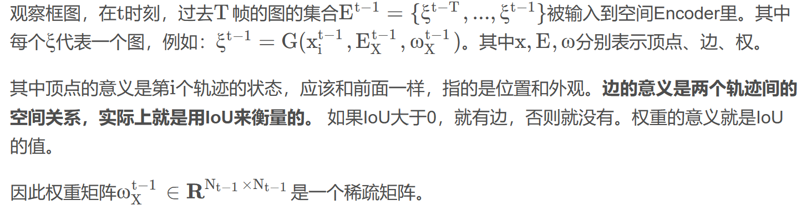
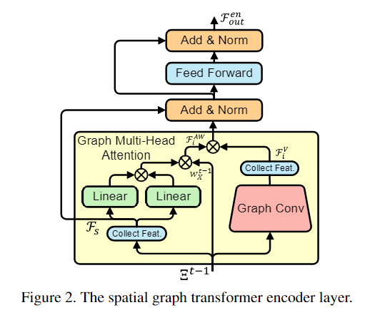
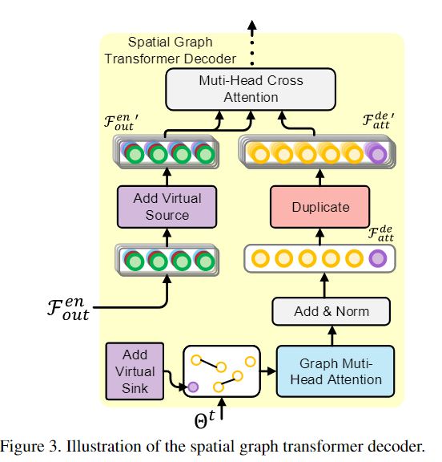
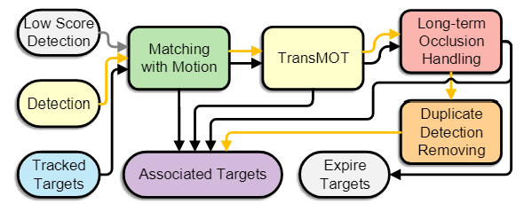

# TransMOT
> TransMOT: Spatial-Temporal Graph Transformer for Multiple Object Tracking

## Abstract
提出TransMOT，利用graph transformer有效建模对象间空间和时间上的交互  
> TransMOT effectively models the interactions of a **large number** of objects by arranging the trajectories of the tracked objects as a set of **sparse weighted graphs**, and constructing **a spatial graph transformer encoder layer**, **a temporal transformer encoder layer**, and **a spatial graph transformer decoder layer based on the graphs**.

为了提高跟踪速度和精度，提出一种级联关联框架，可以处理低置信度检测和长时间遮挡，但需要大量的计算资源  
模型在MOT15、MOT16、MOT17、MOT20都是SOTA  

## Introduction
> There are two core tasks in this framework: accurate object detection and robust target association.(本文主要关注后者)  

Transformer的成功提出了一种通过自注意力机制建模时间依赖性的新范式  
作者提出现有Transformer方法（TrackFormer、TransTrack）三个缺陷：
1. 未考虑大量对象的时空结构 （*只能说没有直接地考虑，其实在decoder的query-key机制处，一个query代表一个object，帧间不断传输其实也考虑了*）
2. 需要大量计算资源和数据
3. 基于DETR的方法并没有达到SOTA

在TransMOT中，所有跟踪目标的轨迹都排列为一系列稀疏加权图，这些图是使用目标之间的空间关系构建的  
基于稀疏图，TransMOT构建了之前提到的3层编/解码器以对时空关系进行建模  
由于图的稀疏性，模型训练和推理效率更高  

另外，文章还提出了一种级联关联结构，通过将TransMOT整合到该框架中，无需额外学习关联部分  
作者最后挖坑，TransMOT还可以与其他检测器或者特征提取子网络结合，形成统一的端到端解决方案  

## Overview

框架主要包含两部分：
- 检测和特征提取子网络
- 时空graph transformer关联自网络

在每一帧，检测和特征提取子网络（蓝色部分）产生M_t个候选检测目标建议，这个建议的集合记为O_t，另外这个网络也计算每个建议的视觉特征  
时空graph transformer为每个tracklet找到最佳建议，并检测特殊事件，例如遮挡、退出、进入  

如何找到每个tracklet的最佳匹配？视作一个优化问题，设计了一个affinity function，估计相似程度  
> 还是类似于一个二部匹配，tracklet就是query，最小化cost，cost是所有匹配affinity的加权和  
> 具体数学公式就不细看了

用稀疏带权图表示目标间的关系，并以此构造了高效的Transformer  
对跟踪对象和新生成的目标之间的关系（特殊事件）进行建模，它会生成一个分配矩阵At  
分配矩阵用于更新跟踪目标，而特殊事件由后续处理模块处理

## TransMOT
时空Transformer（TransMOT）使用当前帧的稀疏带权图θ^t和之前T帧的E^t-1来建模时空相关性并生成映射矩阵A^t  

### 1. Spatial-Temporal Graph Transformer Encoder
空间encoder对轨迹间关系进行建模，时域encoder进一步对轨迹间的时空信息进行混合和编码  

#### Spatial Graph Transformer Encoder Layer

输入图的集合E^t-1，进行特征采样得到特征张量F_s  
特征张量保存了所有节点过去T时刻的特征，每个节点的特征都经过一个线性层  
之后进行自注意力计算  

右侧，采用图卷积对邻居节点信息进行聚合  
图卷积后，顶点特征的张量F^v与F^AW进行计算，再经过AddNorm，FNN等得最终输出  

#### Temporal Transformer Encoder Layer
时域encoder旨在在时间维度上独立地位每个tracklet使用标准的Transformer的Encoder层  
接收前一个Encoder输出后，将张量前两个维度转置，再沿时间维度算自注意力权重，并计算特征张量  

### 2. Spatial Graph Transformer Decoder
Encoders已经从时空上计算了过去T帧轨迹间的联系，Decoder将基于Encoders的输出和当前帧的graph来做预测  

构建当前帧graph的方式与前类似，一个节点代表一个目标，IoU大于0的目标间才分配边，权值就是IoU值  
此外，还有一个Add Virtual Sink的步骤，这个虚拟节点负责本帧当中**退出和遮挡**的轨迹，这个虚拟节点和所有的节点相连，权值为0.5  
将节点特征汇聚起来，经过图多头注意力，再Add&Norm得输出F^de  

对于左边的F^en，为了应对本帧新出现的目标，所以加了一个**虚拟源**得F^en'  
为了将两个张量融合，将F^de复制若干次得F^de'  

之后一起送入多头注意力机制（交叉注意力）得输出，该输出即反映当前轨迹和候选轨迹间的联系  
最后再经过线性层和softmax层消掉特征维度，得分配矩阵A^t
### 3. Training

### 4. Cascade Association Framework
将TransMOT合并到三阶段级联关联框架中实现更好的推理速度和跟踪精度  

第一阶段是用运动信息对低置信度的候选进行匹配  
对于过去一定帧内都成功追踪的轨迹来说，用Kalman滤波去预测状态  
将Kalman预测出的box和候选的box的IoU作为分数，然后用匈牙利算法去匹配，低于阈值的丢掉

第二阶段是TransMOT计算**剩余的**轨迹和候选的拓展分配矩阵(有些低置信度的已经在第一阶段处理了)，用二部匹配算法去做匹配  

第三个阶段是处理遮挡和重复  
对于连续T帧没有匹配的轨迹，用一种欧式的度量方式来重新匹配  
对于可能出现的重复检测，把重合程度高的删去
## Experiments