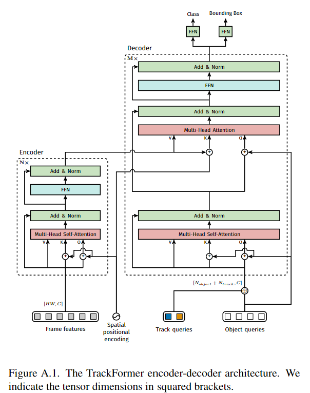

# Transformer
> Attention Is All You Need  

## abstract
a new simple network architecture  
based solely on attention mechanisms

## conclusion
the first sequence transduction model based entirely on attention  
trained significantly faster than architectures based on recurrent or convolutional layers  
plan to apply them to other tasks  

## introduction
recurrent neural networks: long short-term memory, gated recurrent  
language models and encoder-decoder architectures  
disadvantanges of RNN: 时序向下，难以并行；时序较长时丢失信息，否则内存开销大  
> RNN with attention: allowing modeling of dependencies without regard to their distance in their input or output sequences  

The Transformer allows for significantly more parallelization

## Background
使用CNN替代RNN，减少对时序的计算，但使用卷积神经网络计算长序列时比较困难，需要层层卷积  
而卷积可以多输出通道，提出Multi-Head Attention  
Self-attention, memory networks  
> the Transformer is the first transduction model relying entirely on self-attention to compute representations of its input and output  

## Model Architecture

> encoder-decoder stucture  

the encoder maps an input sequence of symbol representation (x1...xn) to a sequence of continuous representations Z=(z1...zn) (zt代表xt的向量表示)  
Given Z, the decoder then generates an outputs squnence (y1...ym) of symbols one element at a time  
**auto-regressive:** consuming the previously symbols as addtional input when generate the next  

> the Transformer follows this overall architecture using stacked self-attention and point-wise, fully connected layers for both the encoder and decoder

### 1. Encoder and Decoder Stacks
> Encoder: a stack of **N=6** identical layers. Each layer has two sub-layers. The first is a multi-head self-attention mechanism, and the second is a simple, position-wise fully connected feed-forward network.

每个层使用'residual connection'，接着'layer normalization' (均值方差，相比batch norm更稳定)  
*the output of each sub-layer is **LayerNorm(x+Sublayer(x))***

残差要求输入输出维度相同，简化模型：  
To facilitate these residual connection, all sub-layers in the model, as well as embedding layers, produce outputs of dimension **d_model=512** 

> Decoder: is also composed of a stack of N=6 identical layers. In addition to the two sub-layers in each encoder layer, the decoder inserts a third sub-layer, which performs multi-head attention over the output of the encoder stack.

带掩码的注意力机制，Masked Multi-Head Attention，保证训练和预测一致 (看不见t时刻后面的序列)  

### 2. Attention
> An attention function can be described as mapping a query and a set of key-value pairs to an output, where the query, keys, values, and output are all vectors.

output是values的加权和(维度相同)，权重由key和query的相似度计算

#### Scaled Dot-Product Attention
将queries和keys做内积作为相似度，接着除维度，再放进softmax  
> Attention(Q,K,V) = softmax(Q*K^T/d_k^1/2)*V (矩阵乘法)  

除根号d_k是因为d_k较大(512，向量较长)，点积值较大，值的相对差值大，算出的梯度会较小  

#### Multi-Head Attention  
与其做一个单个注意力函数，不如把整个query、key等投影到低维，再做h次注意力函数，将结果并在一起投影回来  
> MultiHead(Q,K,V) = Concat(head_1,head_2...head_h)*W^O  
where head_i = Attention(QW_i^Q, KW_i^K, VW_i^V)

#### Application of Attention in our Model

### 3. Position-wise Feed-Forward Networks
applied to each position separately and identically (让MLP对每个词作用一次)  
> FFN(x) = max(0,xW_1+b_1)W_2+b_2

Transformer使用attention将整个序列信息聚合到一个个向量，而后MLP抓取想要的信息  
RNN同样是使用MLP实现语义空间转换，但RNN是将上一个时刻信息逐步往后传递

### 4. Embeddings and Softmax
> use learned embeddings to convert the input tokens and output tokends to vectors of dimension d_model

### 5. Positional Encoding
Attention没有时序信息，顺序打乱后出来的结果是一样的  
在输入里加入时序信息（sin/cos）

## Why Self-Attention
自注意力：query、key、value都是自身。  
transformer只在decoding最后一层attention的query不一样  
> Self-Attention & Recurrent & Convolutional & Self-Attention(restricted)  
考量Complexity per Layer & Sequential Operations & Maximum Path Length  

## Training
### 1. Trainging Data and Batching
### 2. Hardware and Schedule
### 3. Optimizer
### 4. Regularization
