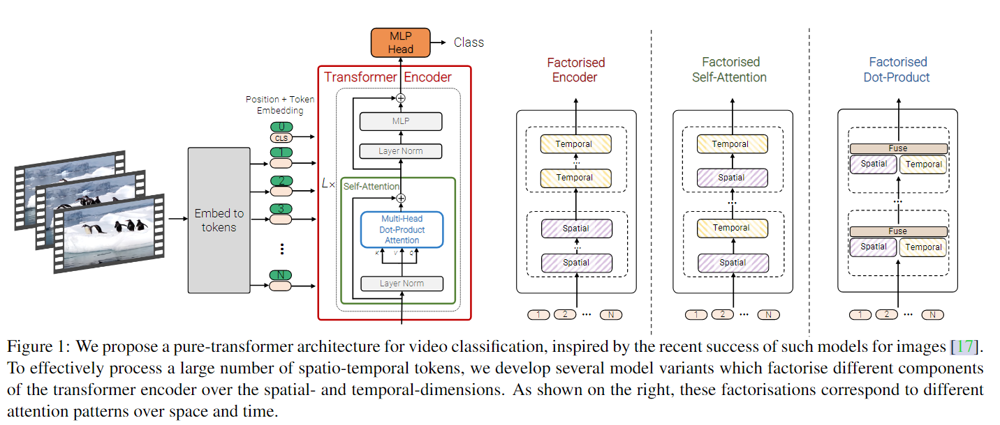
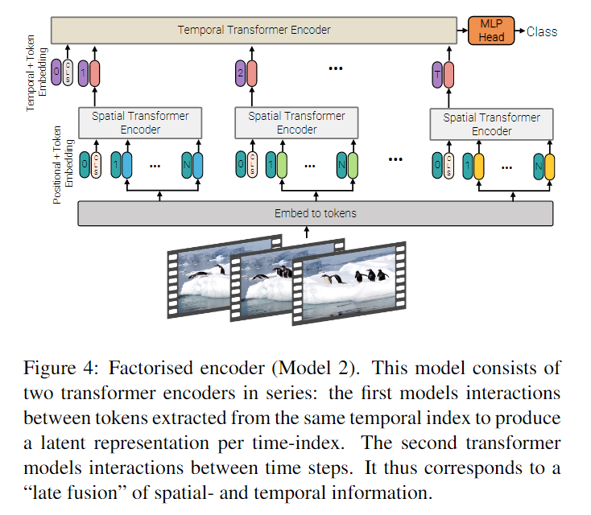

# Video Vision Transformer

## Introduction
Transformer引入视觉领域，比起CNN，Transformer专注于全局上下文，可以快速理解完整的图片  
空间依赖性：分割图像时需要查找周边像素点  
时间依赖性：需要处理连续活动的多个帧  

最简单的思路：将整个视频输入。但是transformer需要为每个token进行计算，必须考虑长范围token的上下文关系以及模型效率问题  

## Related Work
Attention Is ALL You Need  
Transformers For Image Recognition At Scale

## Embeddings
将视频映射到tokens序列，增加位置嵌入，再提供给transformer  
### Uniform Frame Sampling
按照ViT的方式从每个图像独立地进行采样，最后拼接起来

### Tubelet Embedding
将ViT的嵌入拓展到3D，从输入体中提取不重叠的时空管，并作线性投影  
在token本身已经融合了时空信息  

## Proposed Models
### Model1：Spatio Temporal Attention
> This model simply forwards all spatio-temporal tokens extraced from the video, through the transformer encoder

将从视频中提取的token拼接后直接送入Transformer的Encoder中  
模型从第一层就开始对全部token进行成对建模，复杂度很高，效率低下  

### Model2: Factorised Encoder

将**encoder**分为时间encoder和空间encoder  
空间encoder对相同帧的token进行关系建模，并根据输入决定做分类还是全局池化(空间嵌入)。输入某一帧的tokens，输出代表该帧的一个token  
空间encoder得到的帧级别表示信息传入时间encoder，对不同时间序列进行关系建模(时间嵌入)。输入来自空间encoder的不同时间序列的tokens，输出给MLP  

### Model3: Factorised Self-Attention
对来自同一时间序列的所有token计算空间自注意力，然后对相同空间序列的token计算时间注意力，对比Model1，Model 3将自注意力运算分解在更小的集合上，使得运算量与Model 2相同。  

model3分开计算**self-attention**，分别对时空token计算MSA  
Spatial Self-Attention Block仅对同一帧的不同token进行MSA计算  
Temporal Self-Attention Block仅对不同帧相同位置的token进行MSA计算  
作者发现，spatial self-attention block和temporal self-attention block先后顺序无影响  

### Model4: Factorised dot-product attention
粒度更小，Model 4将点积拆分到不同维度，使用不同的**head**分别在空间和时间维度上计算attention权重  
直观地看，Model 3计算空间注意力和时间注意力是串行的，而Model 4可并行计算  

将多头注意力一分为二，一半为Spatial Heads，用于计算空间维度上的注意力；另一半为Temporal Heads，用于计算时间维度上的注意力；然后将两者通过线性映射合并

## Ablation Study

## Conclusion

## Future Work