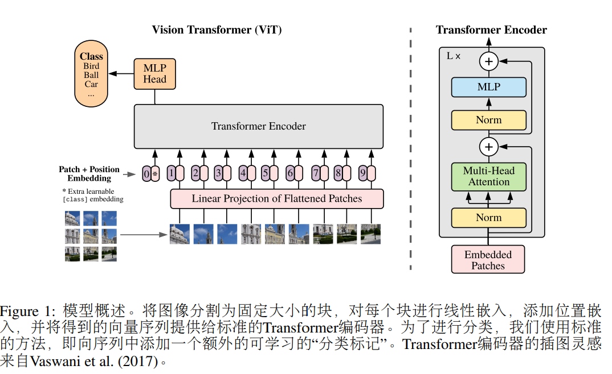

# Vision Transformer
> An Image Is Worth 16*16 Words:  
Transformers For Image Recognition At Scale

## Abstract
虽然Transformer架构在NLP领域大放异彩，但在视觉领域的应用仍然有限，更多的是与CNN一起应用，整体架构保持不变。  
而直接用纯transformer可以表现很好，尤其是在大数据预训练，而后迁移到小数据集。

## Introduction
self-attention-based architectures  
**pre-train on a large text corpus and then fine-tune on a smaller task-specific dataset**  
some works try combining CNN-like architectures with self-attention, some replacing the convolutions entirely  
> applying a standard Transformer directly to images, with the fewest possible modifications  

***将图像分割为块，并将这些块线性嵌入序列作为Transformer的输入***  
Transformer没有归纳偏置，在中型数据集上比ResNets稍弱。但在大数据集预训练而后转到小数据集上时，效果拔群。  

## Conclusion
除了初始提取步骤外，并未引入图像特定的归纳偏置到架构中，使用标准Transformer进行处理。不仅取得了惊人的效果，预训练成本也较低。  

## Related Work
BERT, GPT  
简单地将self-attention应用到图像，关注每个像素，爆炸。-> 局部自注意力，稀疏Transformer，轴注意力...但需要复杂工程去加速。image GPT...

## Method
> In model design we follow the original Transformer as closely as possible

### 1. ViT

标准Transformer需要1D序列，于是把2D图片重塑为一个patches sequence (N=H * W/P^2)  
Transformer在所有层中使用恒定的潜向量大小D，因此将patches sequence通过线性投影映射到D维，称之为patch embeddings  
位置编码使用standard learnable 1D position embeddings，因为使用2D感知位置嵌入并未带来显著性能提升

**Inductive bias:** Vision Transformer的图像特定归纳偏置比CNN小的多。CNN的先验知识贯穿模型始终，Transformer只有MLP层是局部和平移等变性的。图片的2D信息都是从头学习。  
**Hybrid Architecture:** 在patch embedding前加一个CNN。CNN抽出特征帮助Transformer学习。

### 2. Fine-Tuning And Higher Resolution
理论上，保持patch大小相同，提高分辨率，只需要提高序列长度即可。  
但预训练的position bedding可能不再有意义，于是进行2D插值（妥协）

## Experiments

